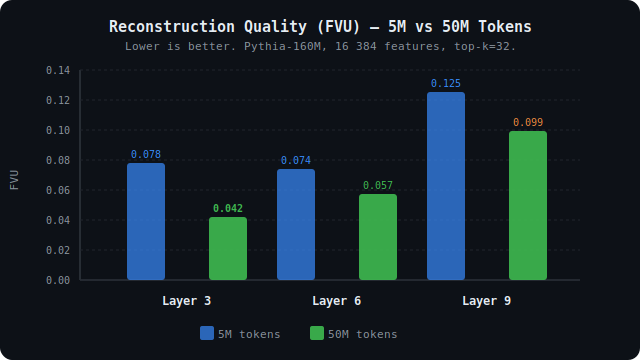
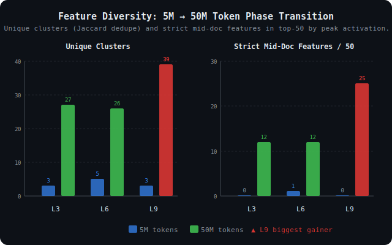
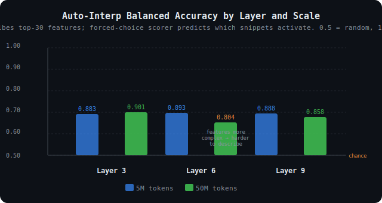

# sae-pythia

Top-k Sparse Autoencoders trained on the residual stream of [Pythia-160M](https://huggingface.co/EleutherAI/pythia-160m), with tooling to surface and score interpretable features.

From-scratch reimplementation of the top-k SAE architecture from Gao et al. 2024 ([*Scaling and evaluating sparse autoencoders*](https://arxiv.org/abs/2406.04093)), applied across layers 3, 6, and 9 of a small open model. The full pipeline fits on a single consumer GPU.

## Key findings

Seven SAE configs across three layers, two scaling axes, 50M → 400M tokens, 16k → 64k features. Autointerp scored by Claude Sonnet 4.5 as judge.

| Run | Tokens | d_sae | FVU | Mean BA (dedupe) |
|---|---|---|---|---|
| L3 50M/16k | 50M | 16,384 | 0.042 | 0.844 |
| L3 200M/16k | 200M | 16,384 | ≈0.042 | 0.810 |
| L6 50M/16k | 50M | 16,384 | 0.057 | 0.795 |
| L6 200M/32k | 200M | 32,768 | 0.043 | 0.864 |
| **L6 400M/64k** | **400M** | **65,536** | **0.039** | **0.923** |
| L9 50M/16k | 50M | 16,384 | 0.099 | 0.804 |
| **L9 200M/16k** | **200M** | **16,384** | **0.090** | **0.928** |

**A phase transition occurs between 5M and 50M tokens.** Dead latents (41% at 5M) collapse to near-zero at 50M, and unique feature clusters jump from 3–5 to 26–39. Layer 9 flips from worst feature diversity to best.

**Dict scaling is the biggest interpretability lever.** The L6 progression 50M/16k → 200M/32k → 400M/64k produces a cleanly monotonic autointerp improvement (0.795 → 0.864 → 0.923). Pure token scaling at fixed dict size is layer-dependent — L9 gains +0.124 from 4× more tokens at 16k, while L3 actually *regresses* slightly because its 16k dict was already saturated at 50M.

**Two distinct scaling regimes.** Cross-scale decoder cosine matching shows *feature refinement* (median cos ~0.67–0.73) when dict size is held fixed and only tokens grow, versus *feature reorganization* (median cos ~0.15) when a model is still below its training phase transition. Feature refinement and feature splitting are different phenomena driven by different axes.

**Best config in the sweep**: L9 200M/16k at mean BA 0.928, 0 dead latents — achieved with only a 16k dictionary, the cheapest configuration in the top tier.

Full analysis: [FINDINGS.md](FINDINGS.md)

### Visualizations

| FVU by layer and scale | Feature diversity phase transition | Auto-interp scores |
|---|---|---|
|  |  |  |

## Why top-k?

Classic L1-penalty SAEs trade reconstruction quality against sparsity via a Lagrange multiplier that is notoriously hard to tune. Top-k SAEs sidestep this: they keep the `k` largest pre-activations per token and zero the rest, giving exact control over the active-feature count and eliminating shrinkage bias on the surviving features. The tradeoff is that dead latents can accumulate, so we include an auxiliary "AuxK" loss that forces the top dead latents to reconstruct the residual — also from Gao et al.

## What's here

Library (`src/sae/`):

- `model.py` — `TopKSAE` module: encoder, top-k activation, unit-norm decoder, AuxK dead-latent revival.
- `activations.py` — streaming activation collector that hooks a chosen layer's residual stream and yields `(B, d_model)` batches without materializing the full corpus in RAM.
- `train.py` — training loop with dead-latent tracking, FVU metric, and checkpoint saving.
- `dashboard.py` — per-feature max-activating-example extraction over streamed Pile documents.
- `autointerp.py` — two-stage Claude-based auto-interpretability: explainer generates a one-sentence description; scorer grades it by forced-choice discrimination (balanced accuracy).

CLI entry points (`scripts/`):

- `train_sae.py` — train a TopK SAE on a chosen layer.
- `build_dashboard.py` — extract top-N max-activating examples per latent from a checkpoint.
- `sample_dashboard.py` — slice a full dashboard to a committable sample; supports `peak`, `mid_document`, and `dedupe` ranking modes.
- `run_autointerp.py` — run the Claude explainer + scorer over a dashboard JSON.
- `compare_layers.py` — compute BOS-cluster size, strict mid-doc count, unique-cluster count, and peak-activation stats across multiple layer dashboards.
- `analyze_geometry.py` — measure decoder superposition via cosine similarity, uniformity loss, and effective rank from SVD.

## Hardware target

Designed for a single RTX 5080 (16 GB). Pythia-160M in fp16 + a 16k-feature SAE on `d_model=768` fits comfortably with room for a 4k-token activation buffer. 50M-token runs take ~24 min per layer.

## Quickstart

```bash
uv sync

# Train a TopK SAE on layer 6 (~24 min at 50M tokens on RTX 5080)
uv run python scripts/train_sae.py --model EleutherAI/pythia-160m --layer 6 --d-sae 16384 --k 32 --tokens 50_000_000 --batch-size 4096

# Build the feature dashboard
uv run python scripts/build_dashboard.py --checkpoint checkpoints/sae_L6_d16384_k32.pt --layer 6 --output dashboards/features_L6.json --num-docs 500

# Sample top-30 deduplicated features for inspection
uv run python scripts/sample_dashboard.py --input dashboards/features_L6.json --output dashboards/features_L6_dedupe.json --rank-by dedupe --top-n-features 30

# Auto-interp with Claude (requires ANTHROPIC_API_KEY)
export ANTHROPIC_API_KEY=sk-ant-...
uv run python scripts/run_autointerp.py --dashboard dashboards/features_L6.json --output dashboards/autointerp_L6.json --num-features 30
```

## Committed artifacts

- `dashboards/features_L*_sample_dedupe.json` — top-30 Jaccard-deduplicated features per layer (5M run)
- `dashboards/features_L*_50M_dedupe.json` — top-30 deduplicated features per layer (50M run)
- `dashboards/layer_comparison.json` / `layer_comparison_50M.json` — cluster metrics across layers
- `dashboards/geometry.json` — decoder superposition metrics
- `dashboards/autointerp_L*.json` — Claude descriptions + balanced-accuracy scores

## License

MIT — see [LICENSE](LICENSE).
